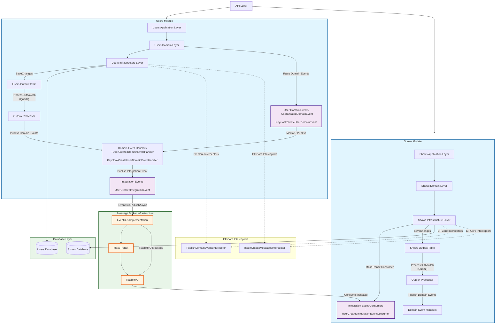

# OneTheater Asynchronous Communication Architecture

## Overview

This diagram illustrates the asynchronous communication patterns within the OneTheater modular monolith architecture, showing how modules communicate through domain events, integration events, and the outbox pattern.

## Architecture Diagram

## Communication Patterns

### 1. Domain Events (Within Module)

- **Trigger**: Domain entities raise domain events during business operations
- **Processing**: EF Core interceptors capture and publish domain events via MediatR
- **Handlers**: Domain event handlers process events within the same module

### 2. Integration Events (Between Modules)

- **Publishing**: Domain event handlers publish integration events to the message broker
- **Transport**: MassTransit with RabbitMQ handles message delivery
- **Consumption**: Other modules consume integration events via MassTransit consumers

### 3. Outbox Pattern

- **Reliability**: Ensures reliable message delivery using transactional outbox
- **Processing**: Quartz jobs periodically process outbox messages
- **Retry**: Failed messages are retried with exponential backoff

## Key Components

### Domain Events

- `UserCreatedDomainEvent`
- `KeycloakCreateUserDomainEvent`

### Integration Events

- `UserCreatedIntegrationEvent`

### Event Handlers

- `UserCreatedDomainEventHandler`
- `KeycloakCreateUserDomainEventHandler`

### Consumers

- `UserCreatedIntegrationEventConsumer`

### Infrastructure

- **Message Broker**: RabbitMQ with MassTransit
- **Outbox**: Database tables for reliable messaging
- **Scheduler**: Quartz for outbox processing
- **Interceptors**: EF Core interceptors for event capture

## Benefits

1. **Loose Coupling**: Modules communicate through well-defined events
2. **Reliability**: Outbox pattern ensures message delivery
3. **Scalability**: Asynchronous processing improves performance
4. **Maintainability**: Clear separation of concerns between modules
5. **Resilience**: Retry mechanisms handle transient failures
